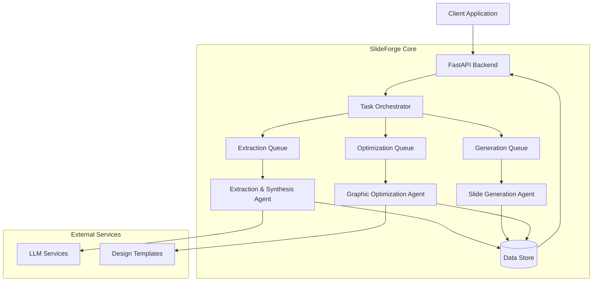
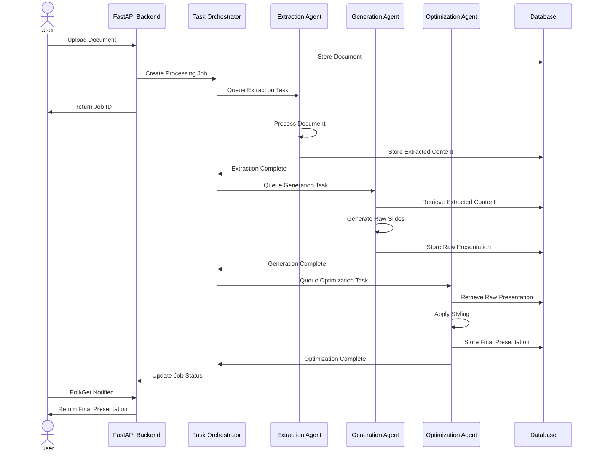
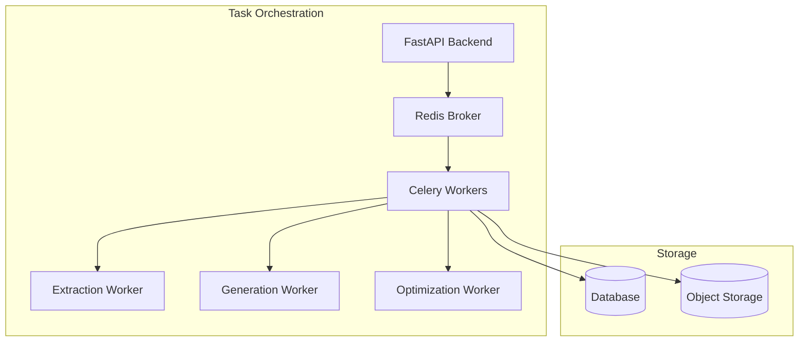
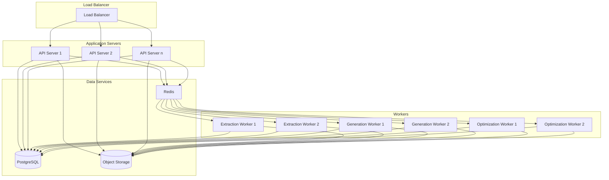

# SlideForge Architecture Plan

## System Overview

SlideForge is a multi-agent system for automated PowerPoint presentation generation from text documents. The system employs AI to extract information, generate slides, and apply appropriate styling.

## Architecture Diagram



## Component Details

### 1. Client Application
- Web or desktop interface for users to upload documents and configure presentation settings
- Displays progress and allows downloading of finished presentations
- May include preview capabilities for generated slides

### 2. FastAPI Backend
- RESTful API endpoints for document uploading, job management, and presentation retrieval
- Authentication and authorization
- Request validation using Pydantic models
- Async handlers for improved performance

### 3. Task Orchestrator
- Manages the workflow between agents
- Tracks job status and handles failure recovery
- Implemented using Celery or similar task queue system
- Provides observability into the processing pipeline

### 4. Extraction & Synthesis Agent
- **Inputs**: Raw documents (PDF, Word, TXT)
- **Outputs**: Structured content (key points, summaries, sections)
- **Key Components**:
  - Document Parser: Handles different document formats
  - LLM Integration: Connects to AI models via LangChain
  - Content Analyzer: Identifies structure, key points, and themes
  - Metadata Extractor: Identifies document context (industry, purpose)

### 5. Slide Generation Agent
- **Inputs**: Structured content from Extraction Agent
- **Outputs**: Raw PPTX with basic slide structure
- **Key Components**:
  - Content Structurer: Organizes content into slide-appropriate chunks
  - Slide Template Manager: Manages slide layout templates
  - PPTX Generator: Creates PowerPoint files with python-pptx or similar
  - Summary Generator: Creates executive summary slides

### 6. Graphic Optimization Agent
- **Inputs**: Raw PPTX from Generation Agent, document context
- **Outputs**: Styled PPTX with appropriate design
- **Key Components**:
  - Style Analyzer: Determines appropriate visual style based on context
  - Design Template Library: Collection of professional design templates
  - Visual Enhancer: Applies styling to slides
  - Quality Validator: Ensures visual consistency and readability

### 7. Data Store
- Stores documents, extracted content, and presentations
- Tracks job status and metadata
- Implemented with SQLAlchemy ORM
- SQLite for development, PostgreSQL for production

## Sequence Diagram



## Database Schema

```mermaid
erDiagram
    User {
        int id PK
        string email
        string password_hash
        datetime created_at
        datetime updated_at
    }
    
    Document {
        int id PK
        int user_id FK
        string filename
        string file_path
        string file_type
        datetime uploaded_at
        int status
    }
    
    ExtractedContent {
        int id PK
        int document_id FK
        json content
        json metadata
        datetime created_at
    }
    
    Presentation {
        int id PK
        int document_id FK
        int extracted_content_id FK
        string filename
        string file_path
        int status
        string style_applied
        datetime created_at
        datetime updated_at
    }
    
    Job {
        int id PK
        int user_id FK
        int document_id FK
        int presentation_id FK
        string status
        json settings
        datetime created_at
        datetime updated_at
        datetime completed_at
    }
    
    StyleTemplate {
        int id PK
        string name
        string category
        json template_data
        string preview_image
    }
    
    User ||--o{ Document : "uploads"
    User ||--o{ Job : "requests"
    Document ||--|| ExtractedContent : "produces"
    Document ||--o{ Presentation : "generates"
    ExtractedContent ||--o{ Presentation : "used_in"
    Job ||--|| Document : "processes"
    Job ||--o| Presentation : "creates"
}
```

## API Design

### RESTful Endpoints

#### Authentication
- `POST /api/auth/register` - Register new user
- `POST /api/auth/login` - User login
- `POST /api/auth/refresh` - Refresh access token

#### Documents
- `POST /api/documents/upload` - Upload new document
- `GET /api/documents` - List user's documents
- `GET /api/documents/{id}` - Get document details
- `DELETE /api/documents/{id}` - Delete document

#### Jobs
- `POST /api/jobs` - Create new processing job
- `GET /api/jobs` - List user's jobs
- `GET /api/jobs/{id}` - Get job status and details
- `DELETE /api/jobs/{id}` - Cancel job

#### Presentations
- `GET /api/presentations` - List user's presentations
- `GET /api/presentations/{id}` - Get presentation details
- `GET /api/presentations/{id}/download` - Download presentation
- `DELETE /api/presentations/{id}` - Delete presentation

#### Templates
- `GET /api/templates` - List available style templates
- `GET /api/templates/{id}` - Get template details

### WebSocket Endpoints
- `/ws/jobs/{id}` - Real-time job status updates

## Agent Orchestration

The system will use Celery for task orchestration with Redis as the message broker. Each agent will be implemented as a separate Celery worker, allowing for independent scaling.



## Deployment Architecture



## Implementation Strategy

### Project Structure

```
slideforge/
├── api/
│   ├── __init__.py
│   ├── main.py
│   ├── dependencies.py
│   ├── auth/
│   │   ├── __init__.py
│   │   ├── routes.py
│   │   ├── models.py
│   │   └── utils.py
│   ├── documents/
│   │   ├── __init__.py
│   │   ├── routes.py
│   │   └── models.py
│   ├── jobs/
│   │   ├── __init__.py
│   │   ├── routes.py
│   │   └── models.py
│   └── presentations/
│       ├── __init__.py
│       ├── routes.py
│       └── models.py
├── agents/
│   ├── __init__.py
│   ├── extraction/
│   │   ├── __init__.py
│   │   ├── agent.py
│   │   ├── document_parser.py
│   │   ├── llm_interface.py
│   │   └── content_analyzer.py
│   ├── generation/
│   │   ├── __init__.py
│   │   ├── agent.py
│   │   ├── content_structurer.py
│   │   └── pptx_generator.py
│   └── optimization/
│       ├── __init__.py
│       ├── agent.py
│       ├── style_analyzer.py
│       └── visual_enhancer.py
├── core/
│   ├── __init__.py
│   ├── config.py
│   ├── security.py
│   └── exceptions.py
├── db/
│   ├── __init__.py
│   ├── base.py
│   ├── session.py
│   └── models/
│       ├── __init__.py
│       ├── user.py
│       ├── document.py
│       ├── presentation.py
│       └── job.py
├── tasks/
│   ├── __init__.py
│   ├── worker.py
│   ├── extraction.py
│   ├── generation.py
│   └── optimization.py
├── schemas/
│   ├── __init__.py
│   ├── user.py
│   ├── document.py
│   ├── presentation.py
│   └── job.py
├── utils/
│   ├── __init__.py
│   ├── storage.py
│   └── logging.py
└── main.py
```

### Development Phases

1. **Foundation Phase**
   - Set up project structure and core dependencies
   - Implement database models and migrations
   - Create basic API endpoints without agent functionality
   - Implement authentication and file upload

2. **Agent Development Phase**
   - Implement each agent separately with mock interfaces
   - Integrate LangChain and AI models for extraction agent
   - Develop PPTX generation capabilities
   - Implement styling and optimization

3. **Integration Phase**
   - Connect agents via task queue
   - Implement end-to-end job processing
   - Add job status tracking and notifications
   - Integrate storage for documents and presentations

4. **Optimization Phase**
   - Implement caching strategies
   - Optimize performance and resource usage
   - Add error handling and recovery mechanisms
   - Implement logging and monitoring

5. **Deployment Phase**
   - Set up containerization with Docker
   - Configure cloud deployment
   - Implement CI/CD pipeline
   - Set up monitoring and alerting

## Technology Stack

### Backend
- Python 3.10+
- FastAPI
- SQLAlchemy
- Alembic for migrations
- Pydantic for data validation

### AI & Processing
- LangChain
- OpenAI API / Anthropic API
- python-pptx
- python-docx
- PyPDF2

### Task Processing
- Celery
- Redis (message broker)
- Flower (monitoring)

### Database
- SQLite (development)
- PostgreSQL (production)

### Storage
- Local filesystem (development)
- S3-compatible object storage (production)

### Deployment
- Docker
- Docker Compose
- Kubernetes (optional for advanced scaling)

### Monitoring
- Prometheus
- Grafana
- OpenTelemetry

## Testing Strategy

- Unit tests for individual components using pytest
- Integration tests for agent interactions
- End-to-end tests for complete workflows
- Performance tests to identify bottlenecks
- CI pipeline with automated testing

## Security Considerations

- JWT-based authentication
- HTTPS for all communications
- Input validation with Pydantic
- Rate limiting for API endpoints
- Secure storage of credentials and API keys
- Compliance with data protection regulations

## Scalability Considerations

- Stateless API design for horizontal scaling
- Independent worker scaling by agent type
- Database connection pooling
- Caching frequently accessed data
- Background processing for resource-intensive operations